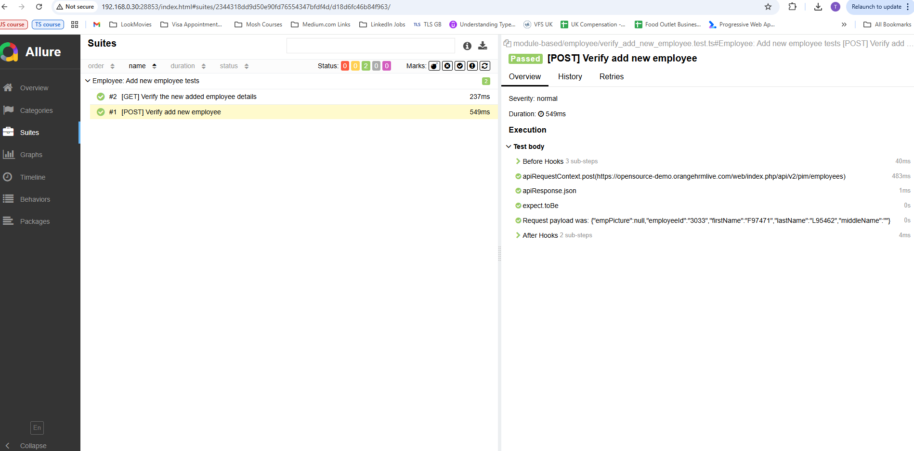

# OrangeHRM Demo API Automation Framework

This is a **demo API automation framework** built with:

- [Playwright](https://playwright.dev/) + TypeScript for API testing
- [Allure Reports](https://allurereport.org/) for rich test reporting
- Target application: [OrangeHRM Demo](https://opensource-demo.orangehrmlive.com/web/index.php)

The project demonstrates a maintainable structure for API test automation, handling authentication, API requests, and reporting.

---

## 🚀 Features

- **Playwright API Testing** – [Playwright](https://playwright.dev/docs/api/class-apirequest) for HTTP request/response handling
- **Authentication Handling** – Auto-fetch & store `orangehrm` session cookie
- **Configurable Environments** – Manage `dev` / `test` details in `auth.json`
- **Reusable Request Handler** – Centralized request utilities (`GET`, `POST`, `PUT`, `PATCH`, `DELETE`)
- **Allure Reporting** – Interactive, detailed test reports with history & trends
- **TypeScript** – Strong typing and maintainable code

---

## 📂 Project Structure

```
orange/
 ├── authentication.ts       # Handles auth cookie generation & storage
 ├── requestHandler.ts       # Generic API request utility wrapper
 ├── playwright.config.ts    # Playwright configuration
 ├── globalSetup.ts          # Global setup (auth, env)
 ├── auth.json               # Stores baseUrl & session cookie
 ├── tests/                  # (Add your test specs here)
 ├── tsconfig.json           # TypeScript config
 └── allure-report/          # Generated Allure report
```

---

## 🛠️ Setup

### Prerequisites

- [Node.js](https://nodejs.org/) (>= 18.x recommended)
- [Allure Commandline](https://allurereport.org/docs/install/) installed globally (`allure --version` should work)
- Git & npm/yarn

### Install dependencies

```bash
npm install
```

---

## ▶️ Running Tests

Run Playwright tests:

```bash
npm test
```

---

## 📊 Allure Reports

Generate & open Allure report:

```bash
npm run allure
```



---

## 🔑 Authentication

- The framework fetches a fresh `orangehrm` session cookie and saves it to `auth.json`
- Cookie is then reused in subsequent API requests
- Auth flow:
  1. Call login endpoint → extract CSRF token
  2. Resend request with token → capture `orangehrm` cookie
  3. Store cookie in `auth.json` for all tests

---

## 📚 References

- [Playwright Documentation](https://playwright.dev/docs/intro)
- [Playwright API Testing](https://playwright.dev/docs/api/class-apirequest)
- [Allure Reports](https://allurereport.org/docs/)
- [OrangeHRM Demo Site](https://opensource-demo.orangehrmlive.com/web/index.php)
